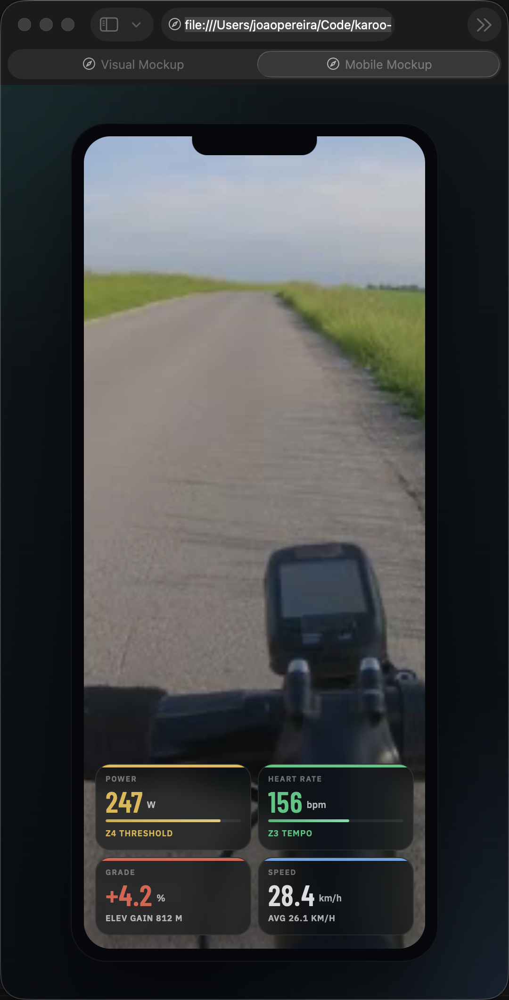

# Karoo Metrics Overlay

A Kotlin Android app for the [Hammerhead Karoo](https://www.hammerhead.io/) bike computer that streams live ride metrics over WiFi as a browser overlay — designed for live streaming with OBS Studio, Streamlabs, or any tool that supports browser sources.

The app runs a lightweight server directly on the Karoo. Point any browser or streaming tool to the overlay URL and get real-time cycling metrics composited over your video feed. If you opt in to location sharing, the overlay can also show a live mini-map and route trace.

**[Download the latest APK](https://github.com/zenpeartree/karoo-metrics-overlay/releases/latest/download/app-release.apk)**

## Screenshots

### Desktop Overlay Mockup


### Mobile / Compact Overlay Mockup



## Metrics

| Metric | Details |
|--------|---------|
| **Power** | Current watts with 7-zone color coding plus avg power in the same tile (based on your FTP), optional in app settings |
| **Heart Rate** | Current BPM with 5-zone color coding (based on your max HR), optional in app settings |
| **Speed** | Current speed in km/h |
| **Distance** | Ride distance in km |
| **Grade** | Current gradient % (color-coded: red uphill, cyan downhill) |
| **Optional Map** | Live location mini-map and route trace, only if location sharing is enabled in the app |

### Power Zones

| Zone | Range | Color |
|------|-------|-------|
| Z1 Recovery | < 55% FTP | Gray |
| Z2 Endurance | 55–75% | Blue |
| Z3 Tempo | 75–90% | Green |
| Z4 Threshold | 90–105% | Yellow |
| Z5 VO2max | 105–120% | Orange |
| Z6 Anaerobic | 120–150% | Red |
| Z7 Sprint | > 150% | Purple |

### Heart Rate Zones

| Zone | Range | Color |
|------|-------|-------|
| Z1 Recovery | < 60% max | Gray |
| Z2 Aerobic | 60–70% | Blue |
| Z3 Tempo | 70–80% | Green |
| Z4 Threshold | 80–90% | Yellow |
| Z5 VO2max | > 90% | Red |

## Install

### Prerequisites

- Hammerhead Karoo (K2 or later) with developer mode enabled
- The Karoo and your streaming device on the **same WiFi network**

### Option 1: Via Hammerhead Companion App (easiest)

1. Download the latest `app-release.apk` from [Releases](../../releases) on your phone
2. Tap **Share** on the downloaded file and select the **Hammerhead** companion app
3. The APK is automatically sent to your linked Karoo and installed

### Option 2: Via ADB

1. Install ADB on your computer ([install guide](https://developer.android.com/tools/adb))
2. Download the latest `app-release.apk` from [Releases](../../releases)
3. Connect to your Karoo via ADB:
   ```bash
   adb connect <karoo-ip>:5555
   ```
4. Install the APK:
   ```bash
   adb install app-release.apk
   ```

## Usage

### Configure

1. On the Karoo, open **Karoo Metrics Overlay** from the app drawer
2. Enter your **FTP** (watts) and **Max HR** (bpm) — these are used to calculate zones
3. Choose whether to **share live location with the browser overlay**
4. Choose whether to subscribe to **Power** and **Heart Rate** fields
5. If Power is enabled, the overlay shows both current power and avg power in the same tile
6. If Heart Rate is disabled, the HR tile is removed from the overlay
7. If location sharing is disabled, the map is removed from the overlay
8. Tap **Start Server**
9. The app displays the overlay URL (e.g., `http://192.168.1.42:9091/`)

### Privacy / Location Sharing

- Location data is **not** sent to the browser overlay unless you enable the location sharing option in the app.
- When location sharing is disabled, the browser overlay does not render the map UI at all.
- When location sharing is enabled, the overlay includes a live mini-map with the current rider position and route trail.

### Add to OBS / Streaming Tool

1. In OBS: **Sources → Add → Browser**
2. Set the URL to the address shown in the app
3. Recommended size without map: **360 × 160**
4. Recommended size with map enabled: **540 × 170**
5. Position the overlay in your desired corner
6. The background is transparent — the video feed shows through
7. Start a ride on the Karoo — metrics update in real time

### Mobile Streaming Setup

For fully mobile setups (e.g., streaming from a phone while riding):

1. Use your phone as a WiFi hotspot
2. Connect the Karoo to the hotspot
3. Use a streaming app that supports browser sources (e.g., Streamlabs)
4. Add the overlay URL as a web/browser layer

## Build From Source

### Requirements

- JDK 17
- Android SDK / command-line tools
- Access to Hammerhead's `karoo-ext` package from GitHub Packages

### GitHub Packages Credentials

The Karoo SDK dependency is resolved from GitHub Packages. Add credentials in `~/.gradle/gradle.properties`:

```properties
gpr.user=YOUR_GITHUB_USERNAME
gpr.key=YOUR_GITHUB_TOKEN
```

Or provide them as environment variables:

```bash
export USERNAME=YOUR_GITHUB_USERNAME
export TOKEN=YOUR_GITHUB_TOKEN
```

The token needs `read:packages` scope.

### Build Commands

```bash
./gradlew test
./gradlew assembleRelease
```

If `../release.keystore` and `KEYSTORE_PASSWORD` are not configured, the custom release signing config is skipped and the build can still complete without that local keystore setup.

## License

Apache 2.0
